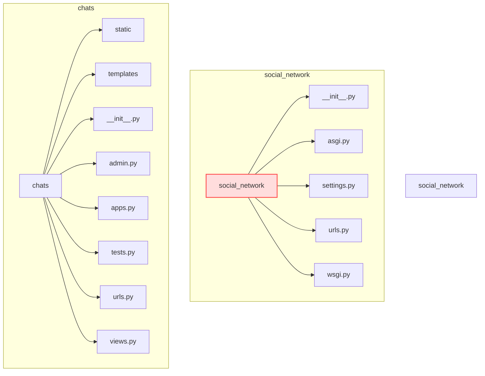

# Project "Social network - Messanger" | Проєкт "Social network - Messanger" 

## Навігація | Navigation on README:
- [Мета створення проєкту | Purpose of the Project](#мета-створення-проєкту--purpose-of-the-project)
- [Склад команди | Developers](#склад-команди--team-members--developers)
- [Посилання | Links](#посилання--links)
- [Структура | Structure of project](#структура--structure-of-the-project)
- [Функціонал кожного з додатків | Functionality of each application](#функціонал-кожного-з-додатків)
- [Як встановити та запустити проєкт? | How to install and run the project?](#як-встановити-та-запустити-проєкт?)
- [Висновок | Conclusion](#висновок)

  
## Мета створення проєкту | Purpose of the Project
Мета створення цього проєкту — практика з нововивченими складовими модуля Django: Django Forms, Class-Based Views, Django Channels для роботи з веб-сокетами, а також використання Ajax і робота з форматуванням дат у iso-формат. Його головна мета — вдосконалення наших навичок програмування, спільної командної роботи та втілення дизайнерських ідей.

___

The goal of this project is to practice newly learned parts of the Django framework: Django Forms, Class-Based Views, and Django Channels for working with WebSockets. It also includes using Ajax and formatting dates in ISO format. The main aim is to improve our programming skills, learn to work better and effectively as a team, and apply design ideas in practice.

## Склад команди | Team members | Developers

* [**Ващенко Артем**](https://github.com/VashchenkoArtem) — Teamlead
* [**Овчаренко Юлія**](https://github.com/JuliaOvcharenko)
* [**Сафонова Анна**](https://github.com/AnnaSafonova30)
* [**Марков Дмитро**](https://github.com/DmitriyM08)
* [**Харлан Кирило**](https://github.com/KirillKharlan)

___

* [**Vashchenko Artem**](https://github.com/VashchenkoArtem) — Teamlead
* [**Ovcharenko Yuliia**](https://github.com/JuliaOvcharenko)
* [**Safonova Anna**](https://github.com/AnnaSafonova30)
* [**Markov Dmitro**](https://github.com/DmitriyM08)
* [**Kharlan Kyrylo**](https://github.com/KirillKharlan)

## Посилання | Links

* [Фігма дизайн](https://www.figma.com/design/20TZphWNufeAQYOe7E1sze/%D0%A1%D0%BE%D1%86%D1%96%D0%B0%D0%BB%D1%8C%D0%BD%D0%B0-%D0%BC%D0%B5%D1%80%D0%B5%D0%B6%D0%B0-World-IT?node-id=6-26&p=f&t=bGAjDfyxAR23sLlY-0)

___

* [Figma design](https://www.figma.com/design/20TZphWNufeAQYOe7E1sze/%D0%A1%D0%BE%D1%86%D1%96%D0%B0%D0%BB%D1%8C%D0%BD%D0%B0-%D0%BC%D0%B5%D1%80%D0%B5%D0%B6%D0%B0-World-IT?node-id=6-26&p=f&t=bGAjDfyxAR23sLlY-0)

## Структура | Structure of the project

