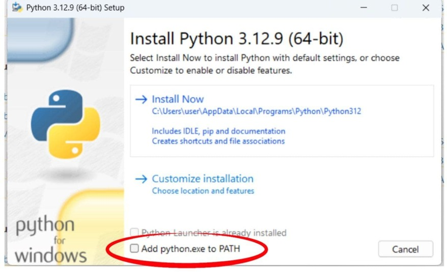
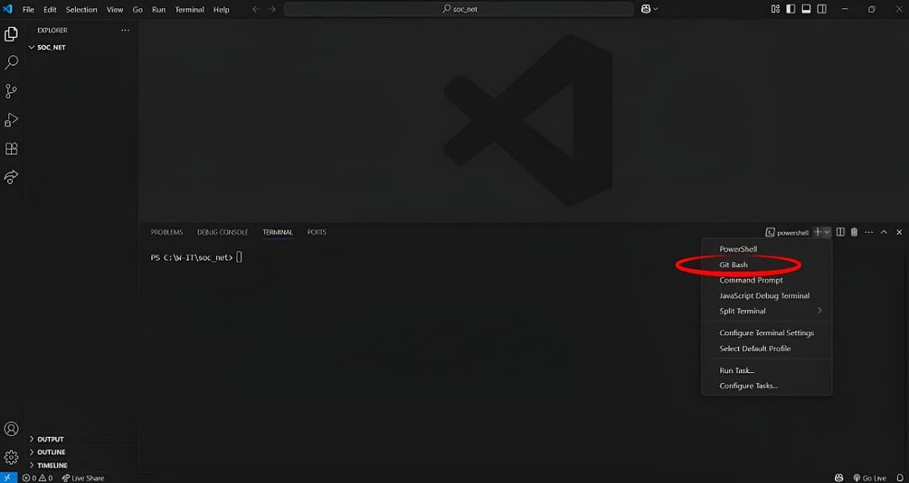

# Project "Social network - Messanger" | Проєкт "Social network - Messanger" 

## Навігація | Navigation on README:
- [Мета створення проєкту | Purpose of the Project](#мета-створення-проєкту--purpose-of-the-project)
- [Склад команди | Team members | Developers](#склад-команди--team-members--developers)
- [Посилання | Links](#посилання--links)
- [Структура | Structure of the project](#структура--structure-of-the-project)
- [Функціонал кожного з додатків | Functionality of each application](#функціонал-кожного-з-додатків--functionality-of-each-application)
- [Особливості функціоналу кожного з додатків з прикладом коду | Features of Each App with Code Example](#особливості-функціоналу-кожного-з-додатків-з-прикладом-коду--features-of-each-app-with-code-example)
- [Як встановити та запустити проєкт? | How to install and run the project?](#як-встановити-та-запустити-проєкт--how-to-install-and-run-the-project)
- [Висновок | Conclusion](#висновок--conclusion)

  
## Мета створення проєкту | Purpose of the Project
Мета створення цього проєкту — практика з нововивченими складовими модуля Django: Django Forms, Class-Based Views, Django Channels для роботи з веб-сокетами, а також використання Ajax і робота з форматуванням дат у iso-формат. Його головна мета — вдосконалення наших навичок програмування, спільної командної роботи та втілення дизайнерських ідей.

___

The goal of this project is to practice newly learned parts of the Django framework: Django Forms, Class-Based Views, and Django Channels for working with WebSockets. It also includes using Ajax and formatting dates in ISO format. The main aim is to improve our programming skills, learn to work better and effectively as a team, and apply design ideas in practice.

## Склад команди | Team members | Developers

* [**Ващенко Артем**](https://github.com/VashchenkoArtem) — Teamlead
* [**Овчаренко Юлія**](https://github.com/JuliaOvcharenko)
* [**Сафонова Анна**](https://github.com/AnnaSafonova30)
* [**Марков Дмитро**](https://github.com/DmitriyM08)
* [**Харлан Кирило**](https://github.com/KirillKharlan)

___

* [**Vashchenko Artem**](https://github.com/VashchenkoArtem) — Teamlead
* [**Ovcharenko Yuliia**](https://github.com/JuliaOvcharenko)
* [**Safonova Anna**](https://github.com/AnnaSafonova30)
* [**Markov Dmitro**](https://github.com/DmitriyM08)
* [**Kharlan Kyrylo**](https://github.com/KirillKharlan)

## Посилання | Links

*  [Фігма дизайн](https://www.figma.com/design/20TZphWNufeAQYOe7E1sze/%D0%A1%D0%BE%D1%86%D1%96%D0%B0%D0%BB%D1%8C%D0%BD%D0%B0-%D0%BC%D0%B5%D1%80%D0%B5%D0%B6%D0%B0-World-IT?node-id=6-26&p=f&t=bGAjDfyxAR23sLlY-0)

___

*  [Figma design](https://www.figma.com/design/20TZphWNufeAQYOe7E1sze/%D0%A1%D0%BE%D1%86%D1%96%D0%B0%D0%BB%D1%8C%D0%BD%D0%B0-%D0%BC%D0%B5%D1%80%D0%B5%D0%B6%D0%B0-World-IT?node-id=6-26&p=f&t=bGAjDfyxAR23sLlY-0)


## Структура | Structure of the project

*  [Фігджем структура проєкту](https://www.figma.com/board/KYEFp7dDKIrO5GBJwWNcF8/Social_network---Structure-of-the-project?node-id=0-1&t=cvBIJdu1IKlfONmC-1)

___


*  [FigJam structure of the project](https://www.figma.com/board/KYEFp7dDKIrO5GBJwWNcF8/Social_network---Structure-of-the-project?node-id=0-1&t=cvBIJdu1IKlfONmC-1)


## Функціонал кожного з додатків | Functionality of each application

<details>
  <summary><strong>📁 chats</strong></summary>

  ---
  > 📁 chats – Додаток для чатінгу.
  Під час розробки ми працювали з Django Channels, WebSockets та обробкою дат у форматі ICO. Додаток є корисним тим, що будь-який зареєстрований користувач може створювати й використовувати як групові, так і особисті чати.
  ---
  > 📁 chats  – Application for chating. During the development process we work with: django channels, web socets, and dates in iso-format. The application is useful because everyone can create or user group or individual chats. 
  ---
</details>

<details>
  <summary><strong>📁 friends</strong></summary>

  ---
  > 📁 friends –  Сторінка друзів. Під час розробки цього додатку ми реалізовали функціонал надсилання запитів для додавання у друзі, видалення користувачів із друзів, перегляду списку наявних друзів, а також рекомендацій потенційних. Для цього використовувалися класи відображення TemplateView та DeleteView. На сторінці відображаються як користувачі, які вже є вашими друзями, так і ті, кого можна додати до списку друзів.
  --- 
  > 📁 friends  – Friends page.This page lets you send friend requests, remove friends, see your current friends, and get suggestions for new friends. We used special view classes called TemplateView and DeleteView to build these features. On the page, you can see people who are already your friends and people you can add as friends.

</details>

<details>
  <summary><strong>📁 main</strong></summary>

  ---
  > 📁 main – Головна сторінка проєкту.
  > Це додаток із функціоналом створення, редагування та перегляду постів, з можливістю додавати зображення вручну (з комп’ютера локалько) чи за допомогою URL-адреси. 
  
  > Застосунок має сучасний інтерфейс із модальними формами, що зручно відкриваються/закриваються без перезавантаження сторінки. 
  * Основні можливості:
    - створювати публікації через інтерактивну форму.
    - переглядати вміст окремих блоків за допомогою кнопок «три крапки».
    - редагувати вже створені пости: зʼявляється форма, яка автоматично підтягує дані через AJAX.
    - додавати зображеннz з компʼютера або через поле введення URL-адрес.
  
  * Під час відкриття модальних вікон основний контент затемнюється для зручності користувача. Усі взаємодії та зміни в HTML-документі здійснюються за допомогою JavaScript, що дозволяє створювати зручний, динамічний і плавний інтерфейс користувача.

  ---
  > 📁 main  – Main Page of the Project.
  
  > This is an app where you can create, edit, and view posts. You can add images either from your computer or using a URL link.

  > The app has a modern design with modal forms that open and close easily without reloading the page.

  * Main Features:

    * Create posts using an interactive form.

    * View content blocks by clicking the "three dots" button.

    * Edit posts using a form that loads the data automatically with AJAX.

    * Add images from your computer or by typing a URL.

  > When a modal window opens, the rest of the page becomes darker to help you focus. All changes and actions on the page are made using JavaScript, which helps create a smooth and dynamic user experience.
  ---
</details>

<details>
  <summary><strong>📁 publications</strong></summary>

  ---
  > 📁 Додаток для створення та відображення особистих публікацій користувача. Під час розробки було реалізовано створення, редагування та видалення постів. Використовувалися такі класи відображення: CreateView, UpdateView, DeleteView.
  ---
  > 📁 publications  – An app for creating and showing personal posts.
  While working on this app, we made it possible to create, edit, and delete posts. We used view classes such as CreateView, UpdateView, and DeleteView.
  ---
</details>

<details>
  <summary><strong>📁 registration</strong></summary>

  ---
  > 📁 registration – Додаток для реєстрації, верифікації та аутентифікації користувача.
  * Основний функціонал:
    -  Введення тільки пошти без імені користувача: Пошта і пароль. 
    -  Валідація даних форми. 
    -  Класи відображення: CreateView, FormView, LogoutView. 
    -  Моделі: User.
    -  Forms: VerificationForm, AuthorithationForm, RegistrationForm.
  ---
  
  > 📁 registration  – An app for user registration, verification, and authentication.

  * Main features:

    - Enter only email and password (no username).

    - Form data validation.

    - View classes: CreateView, FormView, LogoutView.

    - Model: User.

    - Forms: VerificationForm, AuthorizationForm, RegistrationForm.
   ---
</details>

<details>
  <summary><strong>📁 settings_app</strong></summary>

  ---
  > 📁 settings_app – Додаток для налаштувань профілю користувача та для створення альбомів. 
  ---
  > 📁 settings_app  – Application for user profile settings and for creating albums
  ---
</details>


## Особливості функціоналу кожного з додатків з прикладом коду | Features of Each App with Code Example

<details>
  <summary><strong>📁 chats</strong></summary>

  ---
  - Файл social_network/chats/consumers.py
  
    - consumers.py - файл, який обробляє логіку веб-сокет запитів (аналог views.py).
  
    ```python

      from channels.generic.websocket import AsyncWebsocketConsumer # Імпортуємо AsyncWebsocketConsumer - клас у Django Channels, який дозволяє створювати асинхронні WebSocket-з'єднання між сервером і браузером у реальному часі.
      import json # Імпортуємо json для майбутньої передачі text_data у javascript.
      from .forms import MessageForm # Імпортуємо форму для відправки валідованих повідомленнь.
      from channels.db import database_sync_to_async, sync_to_async # Імпортуємо декоратор database_sync_to_async для асинхронної роботи бази даних та декоратор sync_to_async для створення асинхронних методів.
      from .models import ChatGroup, ChatMessage # Імпортуємо моделі для роботи з кімнатами чатів та для повідомлень.
      from settings_app.models import Profile, Avatar # Імпортуємо моделі для роботи з користувачем.
      from django.core import serializers # Імпортуємо модуль serializers, щоб використовувати функцію serialize для форматування python-рядка у json-рядок.

      # Створили клас ChatConsumer, який відповідає за з'єднання сервера с клієнтом. Він відловлює запити та обробляє їх.
      class ChatConsumer(AsyncWebsocketConsumer):
          # Створюємо асинхронний метод connect, який відпрацьовує після запиту про підключення.
          async def connect(self):
              self.chat_pk = str(self.scope["url_route"]["kwargs"]["chat_pk"]) # Отримуємо id групи з динамічного поточного URL під ім'ям "chat_pk".
              self.group_name = self.chat_pk # Створюємо назву поточному чату.

              # Під'єднуємо поточного користувача (тобто його канал) до групи, котра вказана в динамічному URL.
              await self.channel_layer.group_add(
                  self.group_name, self.channel_name
              )

              # Запит про підключення схвалений.
              await self.accept()

          # Створюємо асинхронний метод receive, який відпрацьовує коли сервер отримує повідомленя від клієнта.
          async def receive(self, text_data):
              self.user = self.scope["user"] # Отримуємо поточного користувача.
              username = self.user.username # Отримуємо ім'я поточного користувача.
              id = self.user.id # Отримуємо id поточного користувача.
              avatars = await self.get_avatars() # Викликаємо асинхрону функцію get_avatars для отримання всіх аватарів.
              profile = await self.get_profile() # Викликаємо асинхрону функцію get_profile для отримання всії профілів.
              saved_message = await self.save_message(message = json.loads(text_data)['message']) # Зберігаеємо повідомлення у базу даних та у змінну "saved_message".
              # Відправляємо повідомлення всім участникам групи.
              await self.channel_layer.group_send(self.group_name,
                  {
                      "type": "send_message_to_chat", # Вказуємо тип обробника (метод, що викличиться для відправки повідомлення).
                      "text_data": text_data, # Передаємо повідомлення користувача через event, send_message_to_chat.
                      "username": username, # Передаємо користувача(автора повідомлення).
                      "date_time": saved_message.sent_at, # Передаємо час відправки повідомлення.
                      "user_id": id, # Передаємо id поточного користувача.
                      "all_avatars": avatars, # Передаємо аватар користувача.
                      "profile_id":profile # Передаємо профіль користувача.
                  })
              
          # Створюємо асинхронний метод відправки повідомлення до чату.
          async def send_message_to_chat(self, event):
              text_data_dict = json.loads(event['text_data']) # Перетворюємо текст з формату json у python словник.
              form = MessageForm(text_data_dict) # Передаємо дані у форму для валідації
              username = event['username'] # Отримуємо username поточного користувача
              text_data_dict['username'] = username # Записуємо ім'я поточного користувача до словника у форматі json, щоб отримати та використати у js.
              '''
              Записуємо дату та час відправлення повідомлення до словника у форматі json, 
              щоб отримати та використати у js. Використовуємо функцію isoformat() для переведення дати у iso-формат, 
              щоб локалізувати час у файлі chat.js
              '''
              text_data_dict['date_time'] = event['date_time'].isoformat()
              text_data_dict['user_id'] = event['user_id'] # Записуємо id поточного користувача до словника у форматі json, щоб отримати та використати у js.
              text_data_dict['profile_id'] = event['profile_id'] # Записуємо профіль поточного користувача до словника у форматі json, щоб отримати та використати у js.
              
              if form.is_valid(): # Якщо форма валідна(повідомлення проходить валідацію).
                  await self.send(json.dumps(text_data_dict)) # Відправляємо повідомлення користувачу у форматі json для роботи у chat.js.
          
          # Використовуємо декоратор database_sync_to_async для асинхронної роботи бази даних.
          @database_sync_to_async
          # Створюємо функцію для збереження повідомлення.
          def save_message(self, message):
              content = message # Передаємо контент повідомлення.
              author = Profile.objects.get(user = self.scope["user"]) # Передаємо автора поточного повідомлення.
              group = ChatGroup.objects.get(pk = self.group_name) # Отримуємо поточну групу, у яку потрібно зберігати повідомлення.
              return ChatMessage.objects.create(content = content, author = author, chat_group = group) # Повертаємо створене повідомлення
          
          # Використовуємо декоратор sync_to_async для створення асинхронних методів.
          @sync_to_async
          # Створюємо метод, який потрібен для отримання усіх аватарів.
          def get_avatars(self):
              all_avatars = Avatar.objects.all() # Отримуємо всі аватари.
              return json.loads(serializers.serialize("json", all_avatars)) # Перероблюємо та повертаємо отриманні дані у json-формат для роботи із chat.js.
          
          # Використовуємо декоратор sync_to_async для створення асинхронних методів.
          @sync_to_async
          # Створюємо метод, який потрібен для отримання усіх профілів.
          def get_profile(self):
              self.user = self.scope["user"] # Отримуємо поточного користувача.
              id = self.user.id # Отримуємо id користувача
              profile_id = Profile.objects.get(user_id = id) # Отримуємо усі профілі.
              return profile_id.id # Повертаємо id усіх профілів.
              
    ```
  ___

  - Файл social_network/chats/routing.py
    - routing.py - Файл для маршрутизації WebSocket запитів (аналог urls.py).
  
```python
  from django.urls import path # Імпортуємо функцію path для створення маршрутів.
  from .consumers import ChatConsumer # Імпортуємо клас, в якому прописана уся логіка WebSocket запитів.

  # Створюємо список з url для обробки WebSocket-запитів.
  ws_urlpatterns = [
      path("chats/all_chats/<int:chat_pk>", ChatConsumer.as_asgi(), name="chat") # Створємо шлях для chats, вказуючи ChatConsumer як асинхронний обробник для WebSocket запиту.
  ]
```
  ___

  - Файл social_network/social_network/asgi.py
    - asgi.py - файл для використання у проєкті асинхронності.

```python
    import os
    from django.core.asgi import get_asgi_application
    from channels.routing import ProtocolTypeRouter, URLRouter
    from chats.routing import ws_urlpatterns
    from channels.auth import AuthMiddlewareStack
    '''
    os.environ.setdefault — встановлює змінну середовища, якщо вона ще не задана.

    DJANGO_SETTINGS_MODULE — назва змінної, яка каже Django, який файл налаштувань використовувати.

    'social_network.settings' — шлях до файлу з налаштуваннями.
    '''
    os.environ.setdefault('DJANGO_SETTINGS_MODULE', 'social_network.settings')

    # Створюємо змінну application (об'єкт додатку)
    application = ProtocolTypeRouter({
        # При http-запиті викликається стандартна функція get_asgi_application(), яка перенаправить запит в urls.py
        'http': get_asgi_application(),
        # При ws-запиті викликається функція, яка відправить запит у routing.py
        'websocket': AuthMiddlewareStack(URLRouter(ws_urlpatterns)) 
    })
```
  ___


  - Файл social_network/chats/static/js/chat.js
    - chat.js - файл для взаємодії клієнта з сервером за протоколом WS.

```javascript
    const chatGroup = document.getElementById("chatGroupId").value // Отримуємо value прихованого input з id групи.

    const socketUrl = `ws://${window.location.host}/chats/all_chats/${chatGroup}`; //  Формуємо URL адресу для WS-з'єднання за поточним хостом

    const socket = new WebSocket(socketUrl); // Ініціалізуємо WebSocket (Створюємо WS-з'єднання)

    const messages = document.getElementById("messages"); // Отримуємо div з усіма повідомленнями.
    const form = document.getElementById("form"); // Отримуємо об'єкт форми повідомлення.
    const dateTime = document.querySelectorAll(".message-time"); // Отримуємо усі об'єкти дати та часу.
    // Перебираємо усі об'єкти дати та часу.
    for (let time of dateTime){
        let dateAndTime = new Date(time.textContent); // Створюємо об'єкт дати та часу, передаючи контент(дату та час) конкретного повідомлення.
        let dateAndTimeLocal = dateAndTime.toLocaleString([], { hour: '2-digit', minute: '2-digit' }); // Локалізуємо дату та час до годин | хвилин.
        time.textContent = dateAndTimeLocal // Передаємо контент зміненного повідомлення.
    } 
    // Перевіряємо відправку повідомлення.
    form.addEventListener("submit", (event) => {
        // Відміняємо стандартну поведінку форми(відправки даних)
        event.preventDefault()
        // Отримуємо value повідомлення користувача.
        let message = document.getElementById("id_message").value
        // Створюємо JSONString та перетворюємо його в string | Відправляємо JSONString на сервер | Відправляємо на клієнт.
        socket.send(JSON.stringify({"message": message}))
        // Очищуємо messageForm без оновлення сторінки
        form.reset()
    })
```

  ---
</details>

<details>
  <summary><strong>📁 friends</strong></summary>

  ---
   
  ---
  
  ---
</details>

<details>
  <summary><strong>📁 main</strong></summary>

  ---
   
  ---
  
  ---
</details>

<details>
  <summary><strong>📁 publications</strong></summary>
  
  ___

  - Файл social_network/publications/views.py
    - views.py - файл для логіки додатку.
```python
  from django.contrib.auth.models import User # Імпортуємо модель User
  pubs/views
```

  ___


  - Файл social_network/publications/models.py
    - models.py - У файлі models.py ми визначаємо всі об'єкти, що називаються моделі - Models. Вона містить основні поля та поведінку даних, які ви зберігаєте.
  
```python
  from django.contrib.auth.models import User # Імпортуємо модель User
  pubs/models
```

  ___


</details>


<details>
  <summary><strong>📁 registration</strong></summary>

  - Файл social_network/registration/views.py
    - views.py - файл для логіки додатку.
   
  ---
  ```python
    from django.views.generic.edit import CreateView, FormView # Імпортуємо класи відображення для створення власних.
    from django.views.generic import TemplateView # Імпортуємо клас відображення для створення та рендерінгу власного.
    from django.urls import reverse_lazy # Імпортуємо reverse_lazy для надання зворотного URL як атрибут url загального відображення на основі класу.
    from .forms import VerificationForm, AuthorithationForm, RegistrationForm # Імпортуємо створені форми для валідації даних.
    from django.core.mail import send_mail # Імпортуємо функцію send_mail для відправки gmail-листа користувачеві.
    import random # Імпортуємо random для створення шестизначного коду.
    from django.contrib.auth.models import User # Імпортуємо модель User для створення користувача.
    from settings_app.models import Profile, VerificationCode # Імпортуємо створені моделі профілю та верифікації.
    from django.contrib.auth import authenticate, login # Імпортуємо функцію authenticate | login для аутентифікації та логіну користувача.
    from django.shortcuts import redirect #

    # Створюємо клас RegistrationView на базі вже створенного CreateView для відображення та логіки сторінки реєстрації.
    class RegistrationView(CreateView):
        form_class = RegistrationForm # Вказуємо форму для роботи з валідними даними.
        template_name = "registration/index.html" # Вказуємо файл html для відображення сторінки.
        success_url = reverse_lazy("confirm") # Вказуємо подію перекиду на сторінку верифікації після успішної реєстрації користувача.

        # Створюємо функцію post для .
        def post(self, request, *args, **kwargs):
            email = request.POST.get('email') # Отримуємо email, який користувач відправив у формі при реєстрації.
            if not User.objects.filter(email = email).exists(): # Якщо користувача з такою поштою ще нема.
                return super().post(request, *args, **kwargs) # Успадковуємо батьківський метод post, щоб продовжити стандартну обробку запиту.
            else:
                return redirect("registration") # Або перекидаємо користувача на сторінку реєстрації.
            
        # Створюємо метод form_valid, який відпрацює після того, як дані у формі будуть валідовані.
        def form_valid(self, form):
            response = super().form_valid(form) # Успадковуємо батьківський метод form_valid.
            response.set_cookie('email', form.cleaned_data['email'], max_age=3600) # Записуємо у cookie валідований email користувача на годину.
            special_code = random.randint(99999, 999999) # Створюємо рандомний шестизначний код для підтвердження особистості.
            # user_id = User.objects.get(email = form.cleaned_data['email']).id 
            user = form.save() # Зберігаємо у базу даних дані із форми.
            user.username = f"user-{user.pk}" # Додаємо вручну поле username з його id, яке є обов'язковим для бази даних і необов'язковим для реєстрації користувача.
            user.save() # Зберігаємо у базу даних створений username.
            Profile.objects.create(user = user) # Створюємо профіль на основі даних.
            VerificationCode.objects.create(username = user.username, code = special_code) # Створюємо та зберігаємо у базу даних шестизначний код.
            # Відправляємо email.
            send_mail(
                subject = "Код для підтвердження", # Заголовок листа.
                message = f"Вітаємо!\n ваш код для підтвердження: {special_code}", # Контент листа.
                from_email = "qrprojectdjangoteam2@gmail.com", # Email проєкту, від лиця якого надсилається лист.
                recipient_list = [f"{form.cleaned_data['email']}"], # Відправляємо на адресу користувача.
                fail_silently = False # Якщо в процесі відправки листа відбудеться помилка, показати її.
                )
            # Повертаємо response.
            return response
    # Створюємо клас ConfirmRegistrationView для відображення сторінки та логіки на сторінці confirm. 
    class ConfirmRegistrationView(FormView):
        template_name = "registration_confirm/index.html" # Вказуємо файл html для відображення сторінки.
        form_class = VerificationForm # Вказуємо форму для роботи з валідними даними.
        success_url = reverse_lazy("authorithation") # Вказуємо подію перекиду на сторінку аутентифікації після успішної реєстрації користувача.

        # Створюємо метод form_valid, який відпрацює після того, як дані у формі будуть валідовані.
        def form_valid(self, form):
            '''
                Отримуємо з форми маленькі валідовані інпути для введення даних.
            '''
            input1 = str(form.cleaned_data["input1"])
            input2 = str(form.cleaned_data["input2"])
            input3 = str(form.cleaned_data["input3"])
            input4 = str(form.cleaned_data["input4"])
            input5 = str(form.cleaned_data["input5"])
            input6 = str(form.cleaned_data["input6"])
            
            code_field = input1 + input2 + input3 + input4 + input5 + input6 # Створюємо код на основі інпутів. 
            email= self.request.COOKIES.get("email") # Отримуємо з cookie email користувача.
            username = User.objects.get(email = email).username # Отримуємо з бази даних користувача з email, на який було відправлено лист.
            user_code = VerificationCode.objects.get(username = username).code # Отримуємо з бази даних користувача з тільки-що надісланним кодом.
            
            if user_code == code_field: # Якщо код, який ввів користувач, правильний ш збігається з тим, що надісланий у листі.
                VerificationCode.objects.get(username = username).delete() # Видаляємо код з бази даних.
                return super().form_valid(form) # Повертаємо батьківський form_valid.
            else:
                form.add_error(None, "Код підтвердження не підходе!") # Якщо ні, виводити помилку.
                return self.form_invalid(form) # Форма не валідна.

    # Створюємо клас AuthorizationView для відображення сторінки та логіки на сторінці authorization. 
    class AuthorizationView(FormView):
        template_name="authorization/index.html" # Вказуємо файл html для відображення сторінки.
        form_class = AuthorithationForm # Вказуємо форму для роботи з валідними даними.
        success_url = "/" # Перекид на головну сторінку після успішної аутентифікації.

        # Створюємо метод form_valid, який відпрацює після того, як дані у формі будуть валідовані.
        def form_valid(self, form):
            email = form.cleaned_data['email'] # Отримуємо з форми введений email користувача.
            password = form.cleaned_data['password'] # Отримуємо з форми введений password користувача.
            # Перевіряємо, чи існує користувач з таким username та password.
            user = authenticate(username = email, password = password)
            # Якщо існує, то 
            if user is not None:
                login(self.request, user) # Логінемо користувача
                return super().form_valid(form) # Повертаємо батьківський form_valid.
            else:
                form.add_error(None, "Невірна пошта або пароль") # Якщо ні, виводити помилку.
                return self.form_invalid(form) # Форма не валідна.
  ```
  ---

  - Файл social_network/registration/forms.py
    - forms.py - файл для створення кастомних валідованих форм django.
  ___

  ```python 
      from django import forms # Імпортуємо модуль forms з django
      from django.contrib.auth.forms import UserCreationForm, AuthenticationForm # Імпортужмо UserCreationForm та AuthenticationForm з django.contrib.auth.forms
      from django.contrib.auth.models import User # Імпортуємо модель User з django.contrib.auth.models
      from settings_app.models import Profile # Імпортуємо модель Profile з settings_app.models


      # Створюємо форму для реєстрації, яка наслідує UserCreationForm для створення нового користувача
      class RegistrationForm(UserCreationForm):
          # Додаємо поле для введення електронної пошти
          email = forms.EmailField(max_length = 256,label = "Електронна пошта", widget = forms.EmailInput(attrs = {
                                                                              "placeholder": "you@example.com"
                                                                                    })) #
          # Додаємо поле для введення імені користувача
          password1 = forms.CharField(max_length= 12,label = "Пароль", widget = forms.PasswordInput(attrs = {
                                                                              "placeholder": "Введи пароль"
                                                                                      })) #
          # Додаємо поле для підтвердження пароля
          password2 = forms.CharField(max_length= 12,label = "Підтвердити", widget = forms.PasswordInput(attrs = {
                                                                              "placeholder": "Повтори пароль"
                                                                                      })) #
          # Створюємо мета-клас для вказання моделі та полів, які будуть використовуватись у формі
          class Meta:
              model = User # Вказуємо модель, з якою працюватиме форма
              fields = ["email"] # Вказуємо поля, які будуть включені у форму
              
      # Створюємо форму для авторизації, яка наслідує AuthenticationForm для входу користувача
      class AuthorithationForm(forms.Form):
          # Додаємо поле для введення імені користувача або електронної пошти
          email = forms.EmailField(max_length= 256,label = "Пошта", widget=forms.EmailInput(attrs ={
              "placeholder": "you@example.com" #
          })) 
          # Додаємо поле для введення пароля
          password = forms.CharField(widget = forms.PasswordInput(attrs = {
              "placeholder": "Введи пароль" #
          }), label = "Пароль") #


      # Створюємо форму для верифікації, яка наслідує forms.Form для збору шести полів вводу
      class VerificationForm(forms.Form):
          
          # Додаємо поле вводу 1 для верифікації
          input1 = forms.CharField(label = "", widget=forms.TextInput(attrs = { 
              "class": "input1 input", #
              "inputmode": "numeric" #
          })) 
          # Додаємо поле вводу 2 для верифікації
          input2 = forms.CharField(label = "", widget=forms.TextInput(attrs = { #
              "class": "input2 input" #
          })) 
          # Додаємо поле вводу 3 для верифікації
          input3 = forms.CharField(label = "", widget=forms.TextInput(attrs = { # 
              "class": "input3 input" #
          }))
          # Додаємо поле вводу 4 для верифікації
          input4 = forms.CharField(label = "", widget=forms.TextInput(attrs = { #
              "class": "input4 input" #
          })) 
          
          # Додаємо поле вводу 5 для верифікації
          input5 = forms.CharField(label = "", widget=forms.TextInput(attrs = { #
              "class": "input5 input" # 
          })) 
          
          # Додаємо поле вводу 6 для верифікації
          input6 = forms.CharField(label = "", widget=forms.TextInput(attrs = { #
              "class": "input6 input" #
          })) 
          
          
  ```
  ___

  - Файл social_network/registration/backends.py
    - backends.py - файл для зміни логіки реєстрації та аутентифікації з "ім'я - пошта - пароль" на "пошта - пароль".
```python
  from django.contrib.auth.models import User # Імпортуємо модель User
  from django.contrib.auth.backends import ModelBackend # Імпортуємо звичайні налаштування backend

  # Створюємо клас особливого налаштування backend
  class LoginEmail(ModelBackend):
      # Перестворюємо функцію authenticate
      def authenticate(self, request, username = None, password = None, **kwargs):
          try: # Створюємо оператор try-except
              user = User.objects.get(email=username) # Знаходимо користувача не по ім'ю, а по пошті
              if user.check_password(password): # Перевіряємо пароль
                  return user # Повертаємо користувача 
          except User.DoesNotExist: # Якщо юзер не знайдений 
              return None # Повертаємо None
```

  ___

</details>


<details>
  <summary><strong>📁 settings_app</strong></summary>

  ---
   
  ---
  
  ---
</details>


## Як встановити та запустити проєкт? | How to install and run the project?


> [!NOTE]
> Проєкт стабільно працює на Python 3.8 і вище. Для максимальної сумісності та стабільної роботи рекомендуємо використовувати останню доступну версію Python.
> 
> The project works well with Python 3.8 or higher. To be sure everything works correctly, we recommend using the latest version of Python.


<details>
  <summary><strong>
  
  
  Для Windows | For Windows</strong></summary>

  - 1️⃣ Завантажте та налаштуйте **Python**: Перейдіть на [офіційний сайт Python](https://www.python.org/), знайдіть вкладку ["Downloads"](https://www.python.org/downloads/) і завантажте версію Python відповідно до вашої операційної системи. Під час налаштування обов’язково оберіть опцію "Add python.exe to PATH".
  ___
  - 1️⃣ Download and install **Python**: Go to the [official Python website](https://www.python.org/), open the ["Downloads"](https://www.python.org/downloads/) tab, and download the Python version for your operating system. When installing, make sure to check the box that says "Add python.exe to PATH".

___
  
  
  ___

  - 2️⃣ Завантажте та налаштуйте **Git**: Перейдіть на [офіційний сайт Git](https://git-scm.com/) і завантажте версію Git відповідно до вашої операційної системи.

  ___

  - 2️⃣ Download and install **Git**: Go to the [official Git website](https://git-scm.com/) and download the version of Git for your operating system.

  ___

  - 3️⃣ Завантажте та налаштуйте **Visual Studio Code**: Перейдіть на [офіційний сайт Visual Studio Code](https://code.visualstudio.com/) 
  
  ___

  - 3️⃣ Download and install Visual Studio Code: Go to the [official Visual Studio Code website](https://code.visualstudio.com/) and download the version for your operating system.

  ___

  - 4️⃣ Відкрийте Visual Studio Code, створіть або відкрийте необхідну папку в якій буде знаходитися проєкт.
  ___

  - 4️⃣ Open Visual Studio Code, then create or open the folder where your project will be.
  
    - Відкрийте термінал, оберіть "Git Bash"
  
    - Open the terminal and choose "Git Bash"
  
    
    ___

    - Скопіюйте команду у відкритий термінал:
  
    - Copy the command into the open terminal:
  
      ```sh
      git clone https://github.com/VashchenkoArtem/social_network.git
      ```
    - Створіть віртуальне оточення та активуйте його
    ___

    - Create a virtual environment and activate it

      ```sh
      python -m venv <namevenv>
      ```

      ```sh
      .\<namevenv>\Scripts\activate.bat
      ```

    - Встановіть необхідні бібліотеки в віртуальне оточення з файлу requirements.txt
      
    ___

    - Install the required libraries into the virtual environment from the requirements.txt file

      ```sh
      pip install -r requirements.txt
      ```
      
    - Завантажте channels та daphne для роботи з Django Channels
    ___

    - Install Channels and Daphne for Django Channels

      ```sh
      pip install channels, daphne
      ```
    
    - Перейдіть у папку social_network, в якій знаходиться файл manage.py якщо ви не там

    ___

    - Go to the folder social_network where the manage.py file is, if you are not there yet
  

      ```sh
      cd social_network
      ```

        ```sh
      cd social_network
      ```

    - Проведіть міграції
    ___

    - Run the migrations
  
      ```sh
      python manage.py migrate
      ```

    - Запустіть сервер
    ___
    - Run the project
  
      ```sh
      python manage.py runserver
      ```
  - 5️⃣ Вітаємо! Ви локально запустили проєкт!
  ___
  - 5️⃣ Congratulations! You have successfully run the project locally!
</details>


<details>
  <summary><strong>
  
  
  Для MacOS | For MacOS</strong></summary>


  - 1️⃣ Завантажте та налаштуйте **Python**: Перейдіть на [офіційний сайт Python](https://www.python.org/), знайдіть вкладку ["Downloads"](https://www.python.org/downloads/) і завантажте версію Python відповідно до вашої операційної системи. Під час налаштування обов’язково оберіть опцію "Add python.exe to PATH".
  ___
  - 1️⃣ Download and install **Python**: Go to the [official Python website](https://www.python.org/), open the ["Downloads"](https://www.python.org/downloads/) tab, and download the Python version for your operating system. When installing, make sure to check the box that says "Add python.exe to PATH".

___
  
  
  ___

  - 2️⃣ Завантажте та налаштуйте **Git**: Перейдіть на [офіційний сайт Git](https://git-scm.com/) і завантажте версію Git відповідно до вашої операційної системи.

  ___

  - 2️⃣ Download and install **Git**: Go to the [official Git website](https://git-scm.com/) and download the version of Git for your operating system.

  ___

  - 3️⃣ Завантажте та налаштуйте **Visual Studio Code**: Перейдіть на [офіційний сайт Visual Studio Code](https://code.visualstudio.com/) 
  
  ___

  - 3️⃣ Download and install Visual Studio Code: Go to the [official Visual Studio Code website](https://code.visualstudio.com/) and download the version for your operating system.

  ___

  - 4️⃣ Відкрийте Visual Studio Code, створіть або відкрийте необхідну папку в якій буде знаходитися проєкт.
  ___

  - 4️⃣ Open Visual Studio Code, then create or open the folder where your project will be.
  
    - Відкрийте термінал, оберіть "Git Bash"
    - 
    - Open the terminal and choose "Git Bash"
  
    
    ___

    - Скопіюйте команду у відкритий термінал:
  
    - Copy the command into the open terminal:

    ```sh
      git clone https://github.com/VashchenkoArtem/social_network.git
    ```
    - Створіть віртуальне оточення та активуйте його
    ___

    - Create a virtual environment and activate it

      ```sh
      python3 -m venv <namevenv>
      ```

      ```sh
      source <namevenv>/bin/activate
      ```

    - Встановіть необхідні бібліотеки в віртуальне оточення з файлу requirements.txt
      
    ___

    - Install the required libraries into the virtual environment from the requirements.txt file

      ```sh
      pip install -r requirements.txt
      ```

    - Завантажте channels та daphne для роботи з Django Channels
    ___

    - Install Channels and Daphne for Django Channels

      ```sh
      pip install channels, daphne
      ```
    
    - Перейдіть у папку social_network, в якій знаходиться файл manage.py якщо ви не там

    ___

    - Go to the folder social_network where the manage.py file is, if you are not there yet
  

      ```sh
      cd social_network
      ```

        ```sh
      cd social_network
      ```

    - Проведіть міграції
    ___

    - Run the migrations
  
      ```sh
      python3 manage.py migrate
      ```

    - Запустіть сервер
    ___
    - Run the project
  
      ```sh
      python3 manage.py runserver
      ```
    ___

    - Натисніть на посилання

    ___

    - Click on link
  
  - 5️⃣ Вітаємо! Ви локально запустили проєкт!
  ___
  - 5️⃣ Congratulations! You have successfully run the project locally!
</details>

___

### Висновок | Conclusion 
📱 Проєкт social_network — проєкт, який навчив нас злагодженій роботі у команді та став важливим етапом у поглибленному вивченні Django. 
У процессі розробки ми:
- Застосовували Django Forms, Class-Based Views, Django Channels для роботи з вебсокетами.
- Реалізували Ajax-запити та попрацювали з форматуванням дат у ISO-формат.
- Познайомилися з поняттями реляційних і нереляційних баз даних, використовуючи:

  -  SQLite — для локальної розробки.
  -  MySQL — для глобального використання.
  
  ___

-  Окрему увагу було приділено втіленню дизайнерських ідей — важлива навичка frontend-розробки.
  - Верстання з використанням функції calc() та одиниць виміру vw / vh
  - Адаптивний дизайн, максимально наближений до запропонованого макету.

- 🤝 Командна робота
  - Для забезпечення ефективної та комфортної роботи у команді ми дотримувалися таких принципів:

  - 🔧 Чіткий розподіл задач — кожен учасник відповідав за свій функціонал згідно з розподілом, наданим Team Lead.
  - 📞 Регулярна комунікація — обговорення у відео-чаті загальних проблем написаного коду та його функціоналу, видача тімлідом задач для участників групи. Зустрічі відбувалися щонайменше двічі на тиждень.

  - 🌐 Робота з Git — Усі учасники активно використовували систему контролю версій: створення гілок, злиття, зберігання коду.

  - 🌐 Робота з Github — кожен учасник має власну гілку на [гітхаб-репозиторії](https://github.com/VashchenkoArtem/social_network), виконуючи завдання.
  
- 🛠️ Використані технології
  - У процесі розробки були використані такі технології та інструменти:
  - Python – Основна мова програмування, на якій реалізована серверна логіка проєкту.
  
  - Django — Python фреймворк для швидкої та безпечної розробки веб-додатків. 
  
  - JavaScript — Мова програмування для створення функціоналу, інтерактивності та "краси" на стороні користувача.
  
  - HTML — Мова-конструктор, на якому побудована структура всіх веб-сторінок проекту.
  
  - CSS – Мова, яка відповідає за зовнішній вигляд сторінок: кольори, шрифти, розміщення елементів і «косметичний» функціонал.
  
  - jQuery — JavaScript-бібліотека, яка має спрощені методи для роботи з Ajax.
  
  - SQLite – Реляційна база даних для локальної роботи.
  
  - MySQL — Реляційна база даних для віддаленої роботи.
  
  - Git – Система контролю версій	для відстеження змін у коді.
  
  - GitHub — Онлайн-платформа для збереження Git-проєктів та спільної роботи, публікації, обговорення коду.
  
  - [Figma](https://www.figma.com/design/20TZphWNufeAQYOe7E1sze/%D0%A1%D0%BE%D1%86%D1%96%D0%B0%D0%BB%D1%8C%D0%BD%D0%B0-%D0%BC%D0%B5%D1%80%D0%B5%D0%B6%D0%B0-World-IT?node-id=6-26&p=f&t=bGAjDfyxAR23sLlY-0)
  
  - Markdowm — легка, але обмежена мова розмітки, яка дозволяє швидко оформлювати текст: робити заголовки, списки, виділення, вставляти зображення чи посилання. Команда використовувала для написання README.md.


🎯 Завершивши цей проєкт, ми отримали досвід, пов'язаний із покращенням нововивчених складових модуля Django: Django Forms, Class-Based Views, Django Channels для роботи з веб-сокетами, а також використання Ajax і робота з форматуванням дат у iso-формат. Ми отримали навички злагодженної командної роботи, підготовали веб-застосунок до використання з n-кількістю реальних користувачів. Також наша команда дізналася як працювати із віддаленими базами даних на прикладі MySQL. 

⚠️ Труднощі розробки:
- Неправильний розподіл свого часу — проєкт розроблявся наприкінці навчального року, під час контрольних та тестів | виділення на дипломний проєкт 1,5 місяці.
- Проблеми з роботою дат у iso-форматі.
  
___


📱 Project "social_network"
The social_network project helped us learn how to work together as a team. It was an important step in learning more about Django.

During the project, we:
  - Used Django Forms, Class-Based Views, and Django Channels to work with WebSockets.

  - Used Ajax requests and worked with ISO date format.

  - Learned about relational and non-relational databases:

    -  SQLite – for local work.

    -  MySQL – for global use.

 Design
  - We paid special attention to design ideas — this is an important skill for frontend development.
  - We used:

    - The calc() function and CSS units like vw, vh.
  - Responsive design to make the site look good on all screens.

🤝 Teamwork
We worked as a team. To do this, we:

  - 🔧 Shared the tasks — each person had their part of the project.

  - 📞 Talked often — we had video calls at least two times a week.

  - 🌐 Used Git — we created branches, saved our work, and worked together.

  - 🌐 Used GitHub — each person had their own branch in the GitHub repository.
  
🛠️ Used Technologies

  - During the development, the following technologies and tools were used:

  - Python – The main programming language used for the project’s backend logic.

  - Django – A Python framework for fast and secure web application development.

  - JavaScript – A programming language used to create functionality, interactivity, and "beauty" on the user’s side.

  - HTML – A markup language that builds the structure of all web pages in the project.

  - CSS – A language that controls the look of pages: colors, fonts, layout, and cosmetic functions.

  - jQuery – A JavaScript library that makes working with Ajax easier.

  - SQLite – A relational database for local work.

  - MySQL – A relational database for remote work.

  - Git – A version control system to track changes in the code.

  - GitHub – An online platform to store Git projects, work together, publish, and discuss code.

  - Figma – A design tool used by the team for creating UI and layouts.

  - Markdown – A simple but limited markup language that helps quickly format text: create headings, lists, highlights, insert images or links. The team used it for writing the README.md file.


🎯 What We Learned
After this project:

  - We know more about Django: Django Forms, Class-Based Views, WebSockets, Ajax, and date formats.

  - We know how to work in a team and build a web app for real users.

  - We learned how to use remote databases like MySQL.

⚠️ Challenges
  - Time management — the project was during the school year — all teammate had exams. | We had only 1.5 months to finish it.
  - There were problems with ISO date format.
